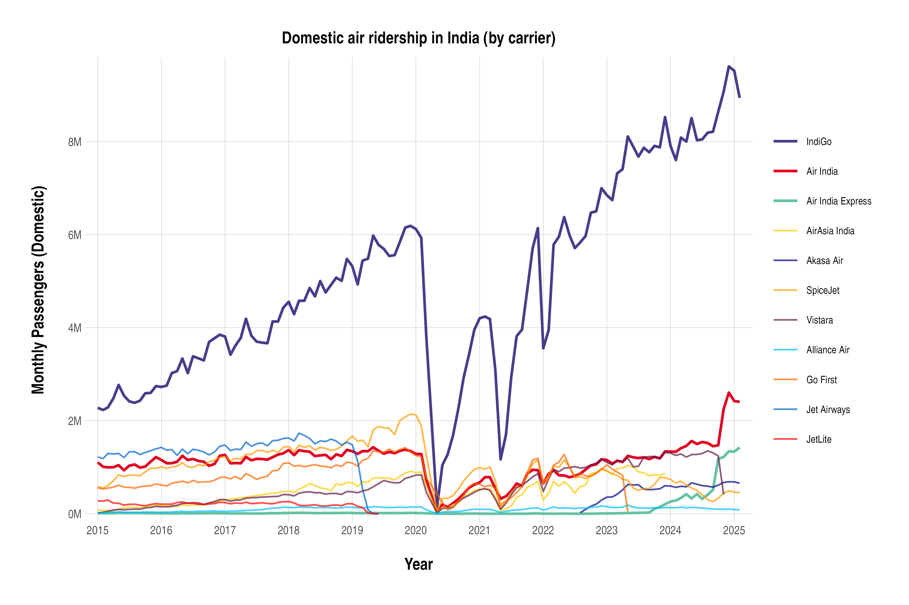
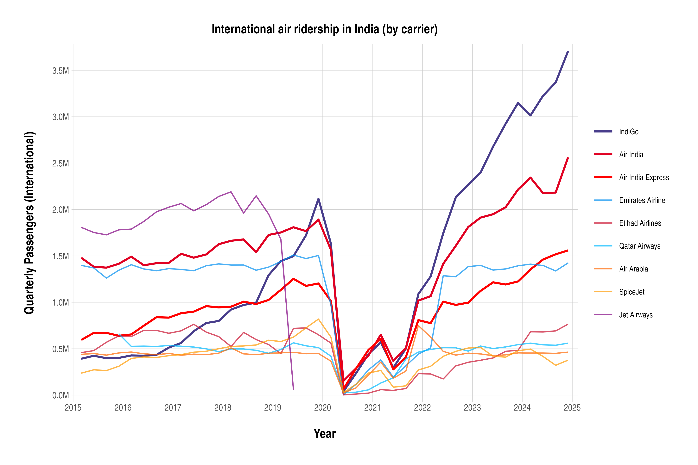
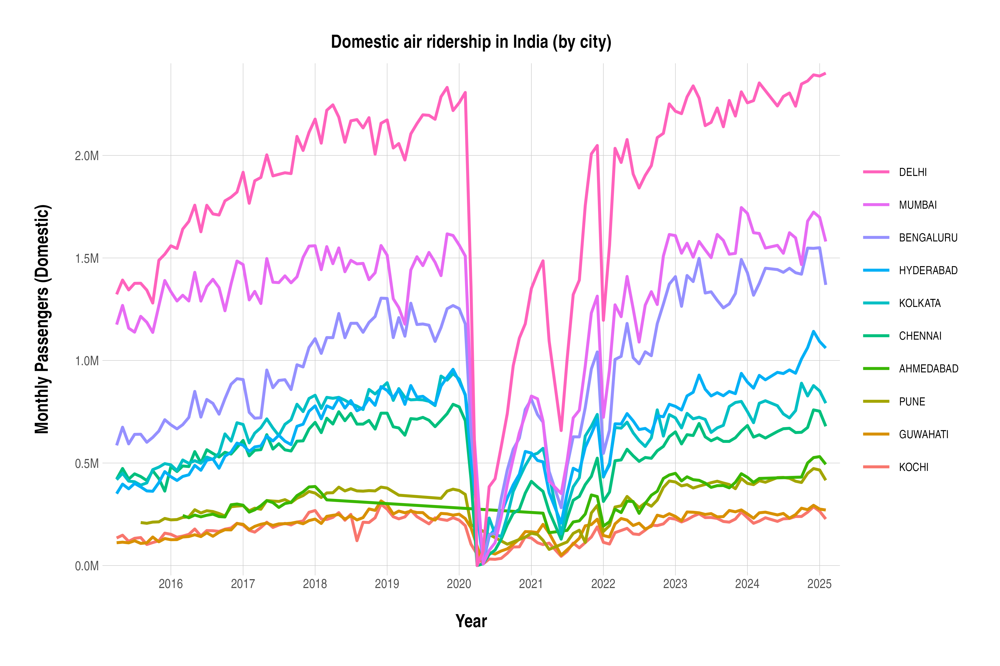

# india-aviation-traffic

Dataset of Indian aviation traffic. Sourced from [DGCA](https://www.dgca.gov.in/) and [Ministry of Civil Aviation](https://www.civilaviation.gov.in/).

Visualize the data on [India Aviation Traffic](https://india-aviation-traffic.pages.dev/).

Explore the raw data:
- [Daily Summary](https://flatgithub.com/Vonter/india-aviation-traffic?filename=aggregated/daily.csv&stickyColumnName=Date) (Ministry of Civil Aviation)
- Carrier-wise: [Domestic](https://flatgithub.com/Vonter/india-aviation-traffic?filename=aggregated/domestic/carrier.csv&stickyColumnName=Airline&sort=Year%2Cdesc) or [International](https://flatgithub.com/Vonter/india-aviation-traffic?filename=aggregated/international/carrier.csv&stickyColumnName=Airline&sort=Year%2Cdesc) (DGCA)
- City-wise: [Domestic](https://flatgithub.com/Vonter/india-aviation-traffic?filename=aggregated/domestic/city.csv&stickyColumnName=City1&sort=Year%2Cdesc) or [International](https://flatgithub.com/Vonter/india-aviation-traffic?filename=aggregated/international/city.csv&stickyColumnName=City1&sort=Year%2Cdesc) (DGCA)
- [Country-wise](https://flatgithub.com/Vonter/india-aviation-traffic?filename=aggregated/international/country.csv&stickyColumnName=Country) (DGCA)

## Visualizations

The source code for the dataset visualization tool is in the [viz](viz) directory.

#### Domestic Airlines

[](http://india-aviation-traffic.pages.dev/)

#### International Airlines

[](http://india-aviation-traffic.pages.dev/)

#### Domestic Airports

[](http://india-aviation-traffic.pages.dev/)

#### International Airports

[](http://india-aviation-traffic.pages.dev/)

#### Airport Pairs

[](http://india-aviation-traffic.pages.dev/)

## Dataset

The complete dataset is available as CSV files under the [aggregated/](aggregated) folder in this repository:

#### Ministry of Civil Aviation Daily Reports

Data: [daily.csv](aggregated/daily.csv?raw=1)

- Sourced from [Ministry of Civil Aviation](https://www.civilaviation.gov.in/)
    - Daily reports are fetched from historical site snapshots available on [Wayback Machine](https://archive.org/)
- Domestic, international, cargo, on time performance, passenger load factor, grievances and more data points reported on the Ministry of Civil Aviation site
- Mid-2022 onwards
    - Report update frequency on the Ministry of Civil Aviation is irregular, and not daily. Many days in between the start and end date have no data points.

#### Monthly Domestic City-wise

Data: [domestic/city.csv](aggregated/domestic/city.csv?raw=1)

- Sourced from the Monthly Statistics (Domestic Air Transport) page in the [DGCA](https://www.dgca.gov.in/) site
- Monthly city-pair wise passenger, freight and mail traffic
- Mid-2015 onwards

#### Monthly Domestic Carrier-wise

Data: [domestic/carrier.csv](aggregated/domestic/carrier.csv?raw=1)

- Sourced from the Monthly Statistics (Domestic Air Transport) page in the [DGCA](https://www.dgca.gov.in/) site
- Monthly carrier-pair wise passenger, freight and mail traffic
- Mid-2015 onwards

#### Quarterly International City-wise

Data: [international/city.csv](aggregated/international/city.csv?raw=1)

- Sourced from the Table 4 reports under the Quarterly Statistics (International Air Transport) page in the [DGCA](https://www.dgca.gov.in/) site
- Quarterly city-pair wise passenger and freight traffic
- 2015 onwards

#### Quarterly International Country-wise

Data: [international/country.csv](aggregated/international/country.csv?raw=1)

- Sourced from the Table 3 reports under the Quarterly Statistics (International Air Transport) page in the [DGCA](https://www.dgca.gov.in/) site
- Quarterly country-pair wise passenger and freight traffic
- 2015 to 2025

#### Monthly International Carrier-wise

Data: [international/carrier.csv](aggregated/international/carrier.csv?raw=1)

- Sourced from [DGCA](https://www.dgca.gov.in/)
- Monthly carrier wise passenger and freight traffic. M1, M2 and M3 correspond to the 1st, 2nd and 3rd month of the quarter.
- 2015 onwards

## Scripts

### DGCA

- [initialize.py](dgca/initialize.py): Initializes the list of XLSX URLs to be fetched
- [fetch.sh](dgca/fetch.sh): Fetches the raw XLSX files from [DGCA](https://www.dgca.gov.in/)
- [parse.sh](dgca/parse.sh): Parses the raw XLSX files, and save them as equivalent CSV files
- [aggregate.py](dgca/aggregate.py): Parses the individual CSV files, and aggregates them into combined CSV files

### Ministry of Civil Aviation

- [fetch.sh](mca/fetch.sh): Fetches historical HTML files of the [Ministry of Civil Aviation](https://www.dgca.gov.in/) site from [Wayback Machine](https://archive.org/)
- [parse.py](mca/parse.py): Parses the HTML files, and aggregates the reports into a CSV file

## License

This india-aviation-traffic dataset is made available under the Open Database License: http://opendatacommons.org/licenses/odbl/1.0/. 
Users of this data should attribute DGCA (https://www.dgca.gov.in/digigov-portal/) and Ministry of Civil Aviation (https://www.civilaviation.gov.in/)

You are free:

* **To share**: To copy, distribute and use the database.
* **To create**: To produce works from the database.
* **To adapt**: To modify, transform and build upon the database.

As long as you:

* **Attribute**: You must attribute any public use of the database, or works produced from the database, in the manner specified in the ODbL. For any use or redistribution of the database, or works produced from it, you must make clear to others the license of the database and keep intact any notices on the original database.
* **Share-Alike**: If you publicly use any adapted version of this database, or works produced from an adapted database, you must also offer that adapted database under the ODbL.
* **Keep open**: If you redistribute the database, or an adapted version of it, then you may use technological measures that restrict the work (such as DRM) as long as you also redistribute a version without such measures.

## Generating

### DGCA

Ensure you have `bash`, `curl`, `python` and `ssconvert` installed

```
# Initialize list of URLs to scrape
python initialize.py

# Fetch the data
bash fetch.sh

# Generate the CSVs
bash parse.sh

# Generate the aggregated CSVs
python aggregate.py
```

The fetch script sources data from DGCA (https://www.dgca.gov.in/)

### Ministry of Civil Aviation

Ensure you have `bash`, `python` and `waybackpack` installed

```
# Fetch the HTML
bash fetch.sh

# Generate the CSV
python parse.py
```

The fetch script sources data from Wayback Machine (https://archive.org/)

## Issues

Found an error in the data processing, have a question, or looking for data aggregated differently? Create an [issue](https://github.com/Vonter/india-aviation-traffic/issues) with the details.

The information in this repository is intended to be updated regularly. In case the data has not been updated for multiple months, create an [issue](https://github.com/Vonter/india-aviation-traffic/issues)

## Credits

- [DGCA](https://www.dgca.gov.in/)
- [Ministry of Civil Aviation](https://www.civilaviation.gov.in/)
